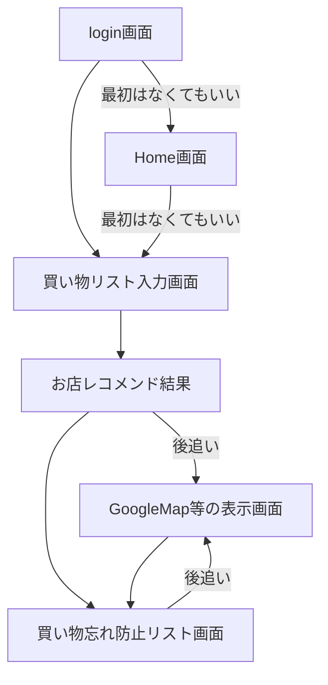
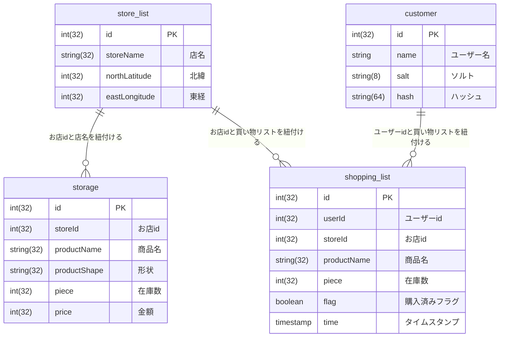

# 買えるところに連れてくでー

買い物先に行ったら、欲しい物が売ってねぇ…。

至るところに探し回る…なんて経験ありませんか？

## デプロイ先 URL

https://yaoya-kandabashi.onrender.com

参考資料

https://miro.com/welcomeonboard/QmpvWEFaMkRUbW1Jek5aTFJINExWZ01MNWRZcjFoZjlsU3N2Vjd5TG1udkZsQVlsVlVDdTJWYzRMdWVMdWhMQnwzNDU4NzY0NTY1NTI3Mjc3NjEyfDI=?share_link_id=898945359511

## 初期セットアップ手順

ルートディレクトリ直下で、

```
npm run setup
```

を行うことでフロントエンド、バックエンド側の npm install が完了します。

フロントエンドとバックエンドを同時に起動する場合は、同じくルート直下で、

```
npm run start
```

コマンドを入力することで、

Vite と express サーバーが立ち上がります。

※補足

Vite: http://localhost:5174

express: http://localhost:4242

で初期設定のままの場合は立ち上がります。

## デプロイに向けて

環境変数を用いて、本番環境と開発環境のコードを切り替えています。

/front フォルダ直下に、`.env.development`と、`.env.production`ファイルを作成してください。

.env.development ファイルには、

`VITE_API_URL=http://localhost:4242`

※ express サーバーのホストを記入

.env.production ファイルには、

`VITE_API_URL=https://yaoya-kandabashi.onrender.com`

など、サービスのドメインを入力してください。

/back フォルダの直下には、`.env`ファイルを作成し、各自開発環境の DB の設定に合わせた DB_NAME, DB_USER, DB_PASSWORD を設定したファイルを記述してください。

## デプロイ先の環境変数

DATABASE_URL: [render の DB の URL]

NODE_ENV: production

NODE_VERSION: 18.18.0

## 画面遷移イメージ

- Login 画面(passport 実装時に必要)
- Home 画面(なくても良い？)
- 買い物リスト入力画面と検索ボタン(GET メソッド)
  - バックエンド側から提案された店名のリストが返ってくる
- リストを元にどのお店に行くかを選択する画面
- 買い忘れ防止リスト表示画面

画面遷移の工程イメージ



## ER 図

user テーブルのソルト・ハッシュが必要になるのか不明(passport)がどんなものかまだわかってません…。



## 機能作成優先順位

- [x] 1. 買い物リストをユーザー側が入力し、お店を提案してくる
- [ ] 2. 買い物リストのチェックボックスを入れて買い忘れ防止機能
- [ ] 3. passport を使ったログイン認証機能(必須要件)
- [ ] 4. 提案されたお店に対するルート案内
- [ ] 5. 距離優先か安さ優先かを選択できる
