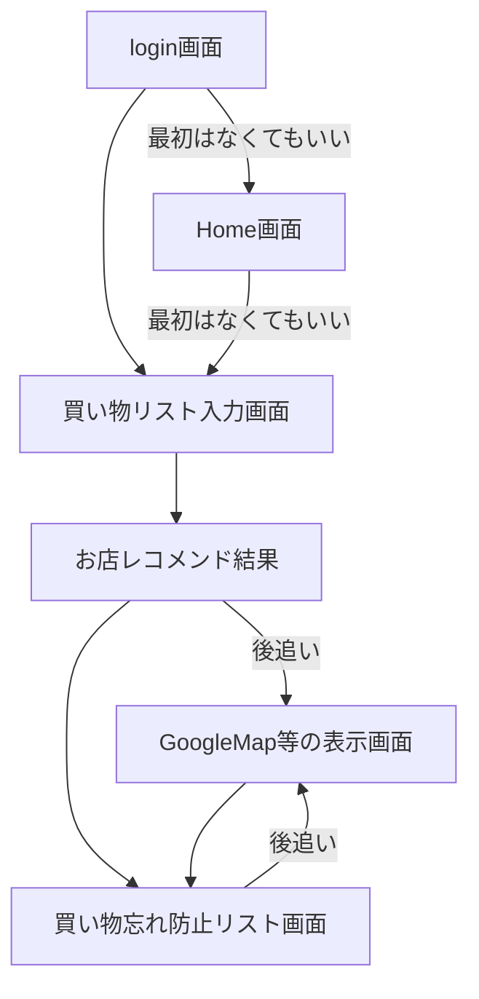
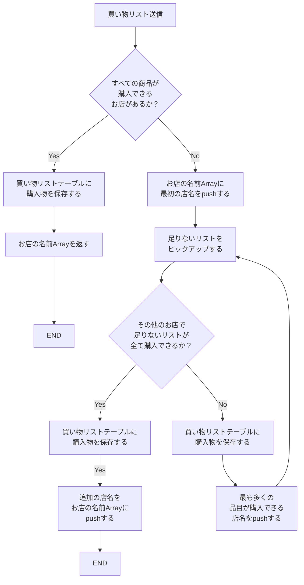
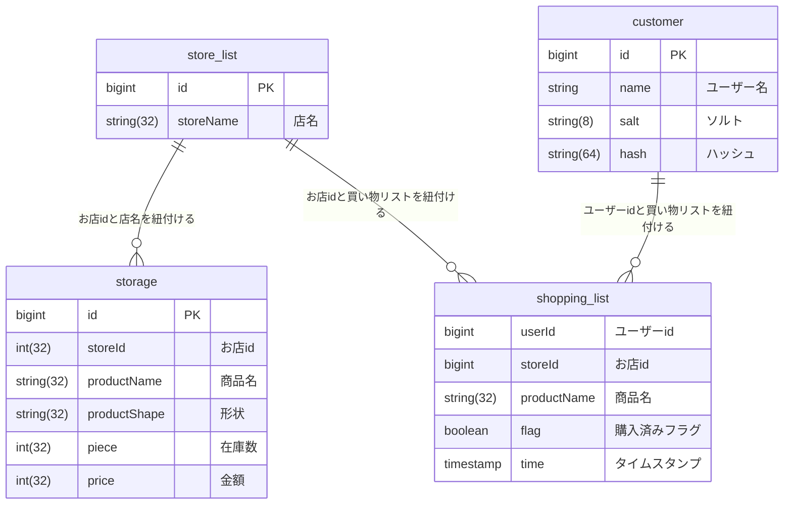

# 買えるところに連れてくでー

買い物先に行ったら、欲しい物が売ってねぇ…。

至るところに探し回る…なんて経験ありませんか？

## 11/28（火） 確認項目

- [ ] データの受け渡しの形式
- [ ] 画面イメージすり合わせ
- [ ] バックエンド側の挙動イメージすり合わせ
- [ ] その他不安点の共有やたなちゅーに宿題ぶん投げ案件募集

## 画面遷移イメージ

- Login 画面(passport 実装時に必要)
- Home 画面(なくても良い？)
- 買い物リスト入力画面と検索ボタン(GET メソッド)
  - バックエンド側から提案された店名のリストが返ってくる
- リストを元にどのお店に行くかを選択する画面
- 買い忘れ防止リスト表示画面

画面遷移の工程イメージ

## 買い物リストの送信とお店提案ロジックフロー

仮作成実施。
最小の店舗で購入できる状態を優先しお店をサーチし提案する。

## ER 図

user テーブルのソルト・ハッシュが必要になるのか不明(passport)がどんなものかまだわかってません…。

## 機能作成優先順位

1. 買い物リストをユーザー側が入力し、お店を提案してくる
2. 買い物リストのチェックボックスを入れて買い忘れ防止機能
3. passport を使ったログイン認証機能(必須要件)
4. 提案されたお店に対するルート案内
5. 距離優先か安さ優先かを選択できる

## 大日程案

基本的な日程は、

- 11/28(火), 11/29(水)11/30(木)の丸３日
- 12/01(金)AM、12/04(月)AM の半日ずつ。

マイルストーン
11/29(水)中：デプロイまで実施が必達

- [ ] 11/28(火)で機能作成優先順位１を完成させたい。
- [ ] 11/29(水)で機能作成優先順位２を完成させる+デプロイまで。
- [ ] 11/30(木)で３の機能実装と 4 の実装準備
- [ ] 12/01(金)AM に 3 まで完成(基本要件は最低限抑える)
- [ ] 12/04(月)地図表示機能・発表資料作成

がふわっとしたイメージ？か。

これとは別にダミーデータの作成(Seed データ)必要っすね…💦

## 日程計画案 11/28(火)

※優先順位 1 と 2 を作るイメージ

(前述の大日程案より巻きの記述にしているので慌てなくてもいい)

- [ ] Block1
  - [ ] README 内容共有(15〜20 分)
  - [ ] フロントエンド・バックエンドのフォルダ作成
  - [ ] フロントエンド
    - [ ] Home 画面作成
  - [ ] バックエンド
    - [ ] Input に対する Where 句を用いたお店レコメンドロジック作成(オブジェクトの Array データが入ってくる前提)
- [ ] Block2
  - [ ] 進捗共有(15 分)
  - [ ] フロントエンド
    - [ ] Home 画面作成
    - [ ] Input 画面作成(リストの追加、オブジェクトの Array としてデータを渡す)
  - [ ] バックエンド
    - [ ] Input に対する Where 句を用いたお店レコメンドロジック作成(オブジェクトの Array データが入ってくる前提)
    - [ ] レコメンドしたお店の地図情報提供(googleMap へのリンクで可)
    - [ ] 買い出しリストの記録(POST)
- [ ] Block3
  - [ ] 進捗共有(15 分)
  - [ ] フロントエンド
    - [ ] Input 画面作成(リストの追加、オブジェクトの Array としてデータを渡す)
    - [ ] Input 画面 GET メソッド作成
    - [ ] 買い出しリストの表示とチェックボックス作成
  - [ ] バックエンド
    - [ ] Input に対する Where 句を用いたお店レコメンドロジック作成(オブジェクトの Array データが入ってくる前提)
    - [ ] レコメンドしたお店の地図情報提供(googleMap へのリンクで可)
    - [ ] 買い出しリストの記録(POST)
    - [ ] 買い出しリストが全て完了したら(DELETE)
- [ ] Block4
  - [ ] 進捗共有(15 分)
  - [ ] フロントエンド
    - [ ] 買い出しリストの表示とチェックボックス作成
    - [ ] 買い出しリストのチェックボックスがすべて完了していなかったらエラーメッセージ
    - [ ] すべてチェックがついていたら DELETE リクエスト
  - [ ] バックエンド
    - [ ] Input に対する Where 句を用いたお店レコメンドロジック作成(オブジェクトの Array データが入ってくる前提)
    - [ ] レコメンドしたお店の地図情報提供(googleMap へのリンクで可)
    - [ ] 買い出しリストの記録(POST)
    - [ ] 買い出しリストが全て完了したら(DELETE)
- [ ] 17 時〜
  - [ ] 進捗確認(15 分)
  - [ ] 明日以降の進め方調整・再確認
  - [ ] デプロイの準備

## 日程計画案 11/29(水)

※優先順位 2 と デプロイ を行うイメージ

(計画は未定)
